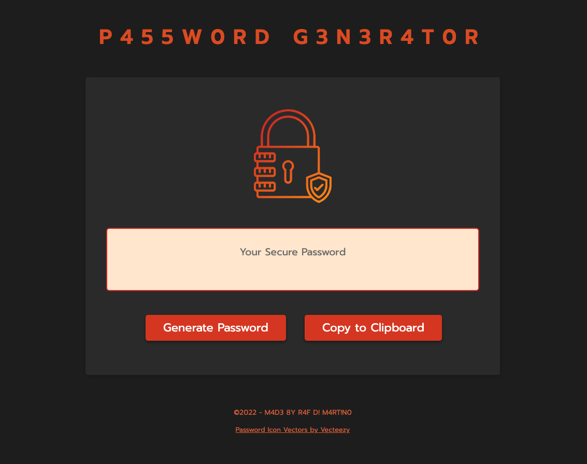

# Password Generator

## Description
In this assignement I had to create an app that runs in the browser and features dynamically updated HTML and CSS, all powered by JavaScript.

My task was to create Password Generator that generates a password when the button "generate password" is clicked.

When you click the button, the application presents a series of prompts for password criteria:

- Length of password:

  - At least 10 characters but no more than 64.

- Character types to choose from:

  - Lowercase

  - Uppercase

  - Numeric

  - Special characters ($@%&*, etc.)

The code also validate for each input so at least one character type should be selected.

Once all prompts are answered, the password is generated and displayed on the page.

As an additional challenge I have create a second button that copies the password to clipboard.

The application fully rensponsive for all the screen sizes.

### Link to the deployed application 
https://rafdimartino.github.io/module-5-challenge-password-generator/

## Installation
N/A

## Usage
Click on the "Generate Password" button, choose from the prompt the criterias for the password you would like to be generated.

Click on the "Copy to Clipboard" button to copy the newly generated password... Now you are ready to paste it where you like.

## Credits
N/A

## License
Please refer to the LICENSE in the repo.